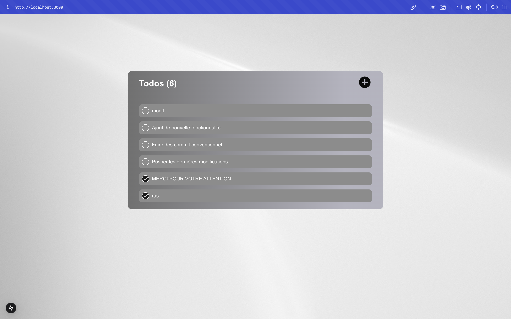

This is a Todo App build in [Next.js](https://nextjs.org) using Json server.

## Getting Started

### Clone the Todo List repository

    git clone https://github.com/AndyMelone/todo_list.git

### navigated to Todo_list directory

    cd todo_list

> [!Important]
> Create .env file in project root and copy env.example to copy in .env

    NEXT_PUBLIC_JSON_SERVER_PORT=3001
    NEXT_PUBLIC_APP_PORT=3000

    NEXT_PUBLIC_JSON_SERVER_HOST=http://localhost

    DATABASE_URL=mysql://root:root@db:3306/todos

    MYSQL_DATABASE=todos
    MYSQL_ROOT_PASSWORD=root
    MYSQL_PORT=3306

### Use Docker compose

> [!NOTE]
> if you want to use Docker compose start the docker daemon and execute

    docker compose up -d

### Build local

> [!NOTE]
> if you don't want to use docker make sure you have [Node JS](https://nodejs.org/en) on your machines

Instal pnpm or using npm

    npm i -g pnpm

install the depedences

    npm install

or

    pnpm install

> [!NOTE]
> For the rest of the suite, I use pnpm. You can use any dependency manager you like, depending on what you have on your machine.

run the development server:

    pnpm run dev

Open a new terminal

    pnpm run json-server

Open [http://localhost:3000](http://localhost:3000) with your browser to see the result.

if you have any questions, don't hesitate to leave me a message
